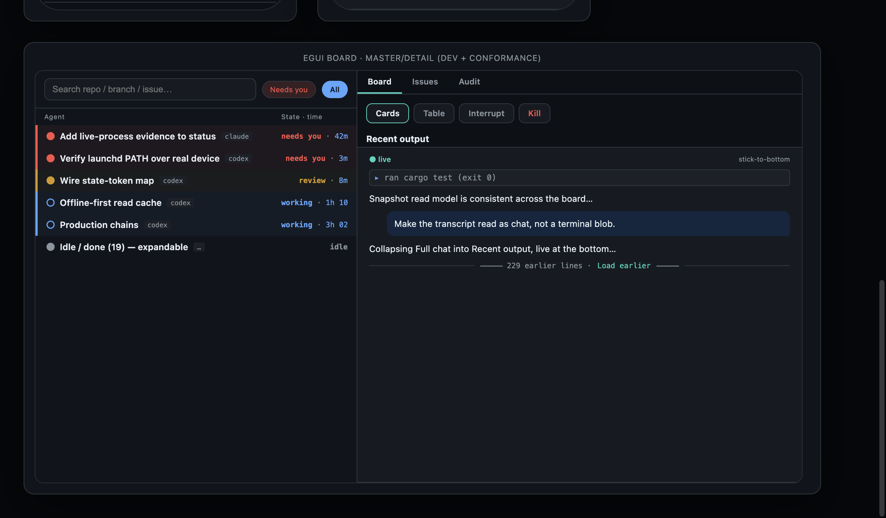

# Corral

[](LICENSE-MIT)

**See every agent. Steer the fleet.**

Corral is a small app that runs on the same machine as your [herdr](https://github.com/herdrdev/herdr) fleet and gives you one place to watch and control it — from a desktop board or your phone.

If you run a fleet of coding agents (Claude Code, Codex, OpenCode, and others), herdr handles the spawning and supervising. Corral sits on top and answers the two things you actually want to know:

- **What's happening right now?** One live view of every agent, its state, what it's waiting on, its branch, PR, and CI.
- **Do something about it.** From your phone — prompt, interrupt, approve, read its output, or stop it. No SSH, no terminal needed.

```
herdr socket ─┐                    ┌─ live fleet snapshot + events (SSE)
git watcher ──┤ → corrald (daemon) → ├─ signed drive: prompt · interrupt · approve · read · kill · attach
              └                    └─ register devices · grants · audit log
```

## See it in action



*The desktop board (egui) and the phone app (iOS) share the same live fleet picture. Demo walkthrough video coming soon.*

## Features

- **One live view of the fleet** — every agent, its state, what it's blocked on, its repo/branch, PR, and CI, all on one board.
- **Steer it from your phone** — prompt, interrupt, approve, read output, kill, or attach an agent, with signed, capability-gated commands.
- **Know what needs you** — blocked agents are surfaced first with the exact question they're waiting on, so you answer in two taps instead of digging through eight terminals.
- **Approvals that can't go wrong** — an approve action is bound to the exact prompt's hash, so you can't approve the wrong question.
- **Harness-agnostic** — Claude Code, Codex CLI, OpenCode, and others become the same canonical record, so the board and controls work the same no matter which agent is running.
- **Event history + daily digest** — every state change is recorded; query a window or take a per-agent daily summary.
- **Signed and private by default** — binds to loopback, denies public addresses, and requires per-device grants before any write.

## Architecture

The full design is in [docs/ARCHITECTURE.md](docs/ARCHITECTURE.md). In short:

- **`corrald`** — the daemon. Reads the fleet (herdr + a git watcher) into a live snapshot, serves it over HTTP + SSE, and accepts signed drive commands.
- **`corrald-ui`** — the desktop board (egui).
- **iOS notifier** — the phone app.
- **Layering** — model → harness → runtime → control plane. Everything is written down in the docs.

## Install

### From the App Store (iPhone, coming soon)

Corral will be available on the App Store. Link will be added here when it's live.

### The desktop board + daemon (macOS)

Grab a tagged release — no Rust toolchain needed. The installer downloads a checksummed bundle, verifies its SHA-256, installs the daemon under launchd, and stages the desktop board:

```sh
bash <(curl -fsSL https://raw.githubusercontent.com/jirathip-dev/corral/main/scripts/install-corral.sh)
```

From a checkout, the same script runs directly:

```sh
bash scripts/install-corral.sh
bash scripts/install-corral.sh --release v0.1.0 --bind 127.0.0.1 --port 8474
```

Uninstall removes the launchd agents and the app, keeps your config and keys:

```sh
bash scripts/install-corral.sh --uninstall
```

### Dependencies

- **herdr** — the runtime that spawns and supervises the agents. Install it first. (Corral reads the fleet from herdr's socket; without herdr it still serves the API but shows no agents.)
- **macOS** for the release build and the iOS app. The daemon also builds on Linux.

### Set up the daemon (herdr + launchd)

`corrald` runs as a launchd agent. From a checkout, `scripts/setup-corrald.sh` builds and installs it (idempotent — safe to re-run):

```sh
bash scripts/setup-corrald.sh            # build + run under launchd on 127.0.0.1:8474
```

Once it's up, register a device and grant it a capability (defaults to read-only). See the full walkthrough in [docs/QUICKSTART.md](docs/QUICKSTART.md).

## Security posture

Corral is private by default:
- **Loopback by default, public refused** — binds `127.0.0.1`; public IPs and `0.0.0.0` are hard refusals. Over a tailnet/private network, prefer a WireGuard device-authenticated tunnel.
- **Signed writes, default deny** — every drive command carries an Ed25519 device signature; a registered device has zero grants until the host grants capabilities. No auto-approve.
- **Step-up for destructive payloads** — risky operations need a short-lived biometric token. All writes land in a hash-chained audit log.

## Docs

- [docs/QUICKSTART.md](docs/QUICKSTART.md) — run the daemon, register a device, read the fleet
- [docs/ARCHITECTURE.md](docs/ARCHITECTURE.md) — the read model, signed drive plane, security boundaries
- [docs/OPERATIONS.md](docs/OPERATIONS.md) — device lifecycle, grants, remote access from iOS, keychain, audit log
- [docs/DEVELOPING.md](docs/DEVELOPING.md) — workspace layout, module map, how to add a capability
- [docs/corral/P4-conformance.md](docs/corral/P4-conformance.md) — the normative wire contract

## Status

**Pre-1.0, macOS-first.** Daemon and desktop board run on macOS (daemon also Linux); the iOS notifier needs an Apple developer account for TestFlight. Linux support is partial.

## License

Dual-licensed under [MIT](LICENSE-MIT) OR [Apache-2.0](LICENSE-APACHE).
