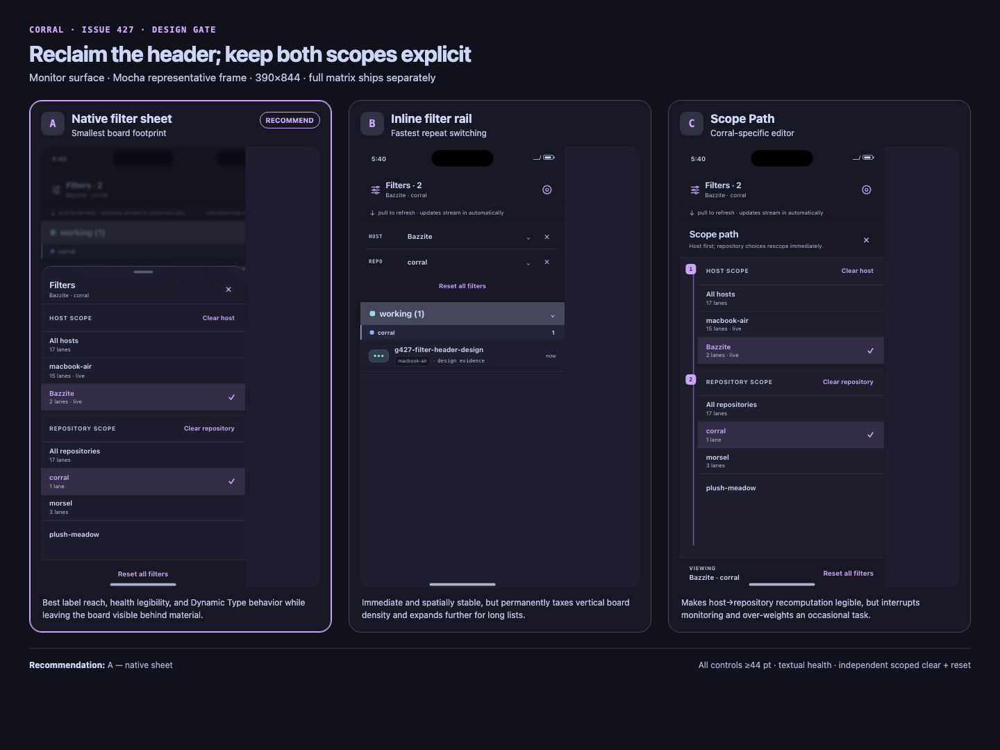
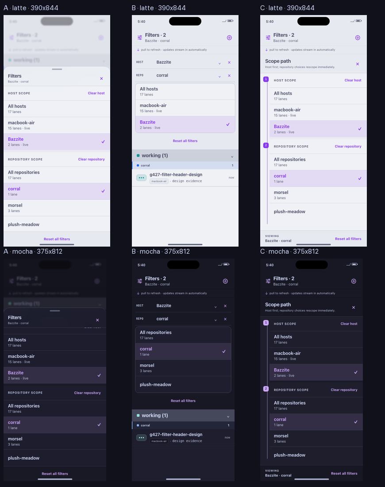

# Corral #427 — filter/header redesign

**Status: PROTOTYPE — awaiting Guy approval.** This bundle is design evidence only. It does not approve implementation, change runtime behavior, open a production PR, or restore the removed `Fleet` title.

## Recommendation

**Choose A — compact header affordance + native filter sheet.**

A is the smallest interaction that keeps every host/repository label and host-health phrase reachable at phone width. It uses the currently empty top-left header area, keeps Settings top-right, leaves the board visible behind native material, and gives Dynamic Type a vertical scrolling surface instead of compressing labels into chips.

Open the interactive prototype: [`index.html`](index.html)

Review the comparison sheet:

## Surface and stance

**Surface archetype: Monitor.** The board answers “what needs attention and what is moving?” The redesign therefore preserves the existing flat, full-bleed status/repository/row hierarchy. It does not introduce a hero, dashboard-card grid, fake metrics, or a second visual language.

The header becomes a compact stateful control:

- zero active filters: `Filters` + `All hosts · All repositories`;
- one active filter: `Filters · 1` + the selected scope summary;
- two active filters: `Filters · 2` + `Bazzite · corral`;
- Settings remains a distinct 44 pt control on the top-right.

Selections apply immediately. Closing the surface preserves the current selection; there is intentionally no Apply button. `Clear host`, `Clear repository`, and `Reset all filters` remain separate actions.

## Three materially distinct directions

### A — native filter sheet — recommended

- Top-left `Filters · n` opens a bottom sheet.
- Drag handle and explicit close button; board context remains visible behind it.
- Host scope first, with textual `live`, `connecting`, and `offline · stale 6m` health.
- Repository scope second, visually independent.
- Vertical option rows scale cleanly and scroll under a pinned reset footer.
- Prototype material uses the product’s 80% Catppuccin-base fallback plus blur. Native implementation should reuse the existing `TranslucentSheetBackdrop` availability gate (10% Liquid Glass tint on iOS 26+, 80% themed fallback below it).

### B — compact inline filter rail

- Host and repository live as separate inline selector rows above the board.
- Each row exposes its own clear button; reset stays in the rail.
- The picker expands inline rather than becoming modal.
- Best for rapid repeated switching, but the closed rail permanently spends board height and long lists expand into the monitoring surface.

### C — Scope Path wild-card

- The header swaps the board into a dedicated, native-list filter editor.
- A Corral-specific numbered spine explains the existing host-first → repository-rescope behavior.
- The current `Viewing` summary remains pinned at the bottom.
- Strongest explanation of the model, but it interrupts monitoring and visually over-weights a secondary task.

## Rejected tradeoffs

- **B is not recommended:** fastest repeat switching, but always consumes vertical space and makes the board compete with an expandable menu.
- **C is not recommended:** clearest model explanation, but the custom path metaphor is more interaction than this task needs and temporarily replaces the board.
- **Two horizontal chip rows were rejected:** they recreate the source defect—duplicate unexplained `All`, clipped long labels/status, and excess vertical chrome.
- **A single combined scope was rejected:** host and repository remain independent selections, as required by `BoardModel`.
- **Color-only health was rejected:** every non-steady posture has text; color is supplementary only.

## Evidence coverage

The complete matrix is **3 variants × 7 states × 4 palettes × 2 widths = 168 phone PNGs** under [`screenshots/matrix/`](screenshots/matrix/). Filenames carry all four labels:

`variant-<a|b|c>__palette-<flavor>__width-<WxH>__state-<state>.png`

| Required state | What the evidence proves |
|---|---|
| populated multi-host board | default scope, source-derived board structure, all options reachable |
| host-only filtering | `Filters · 1`, `Bazzite · All repositories`, host scoped clear |
| repository-only filtering | `Filters · 1`, `All hosts · corral`, repository scoped clear |
| both filters active | `Filters · 2`, `Bazzite · corral`, filtered board context |
| connecting host | `macbook-air · connecting` is textual in the host-first scope |
| offline/stale host | `Bazzite · offline · stale 6m` plus retained-lane wording |
| zero results | exact active summary, scoped rail/header access, visible `Reset all filters` |

Palettes: **Latte, Frappé, Macchiato, Mocha**. Widths: **390×844 and 375×812**.

Fast visual review:

- [A · 390 contact sheet](screenshots/contact-sheets/contact__variant-a__width-390x844.png)
- [A · 375 contact sheet](screenshots/contact-sheets/contact__variant-a__width-375x812.png)
- [B · 390 contact sheet](screenshots/contact-sheets/contact__variant-b__width-390x844.png)
- [B · 375 contact sheet](screenshots/contact-sheets/contact__variant-b__width-375x812.png)
- [C · 390 contact sheet](screenshots/contact-sheets/contact__variant-c__width-390x844.png)
- [C · 375 contact sheet](screenshots/contact-sheets/contact__variant-c__width-375x812.png)

## Accessibility proof

Six enlarged Dynamic Type frames cover A/B/C at both reference widths: [`screenshots/accessibility/`](screenshots/accessibility/).

- all interactive controls: ≥44×44 CSS pt in rendered geometry;
- `All hosts` and `All repositories`: distinct visible text and VoiceOver labels;
- `Clear host` / `Clear repository`: separate VoiceOver actions;
- selected scope: highlight + trailing native-style check + `aria-pressed`;
- no horizontal overflow at either width;
- long options wrap instead of truncating;
- top and scrolled-end Dynamic Type captures prove the terminal `plush-meadow` option remains reachable;
- reduced-motion media query disables non-essential motion.

## Verification result

`verification.json` is PASS:

- 175/175 required PNGs verified at exact dimensions: 168 matrix + 6 accessibility + 1 comparison;
- 60/60 rendered DOM cases pass console, horizontal-overflow, scope-order, VoiceOver-label, scrolling-reach, and 44 pt target gates;
- 28/28 contrast checks pass WCAG AA; minimum measured ratio is 4.68:1;
- deterministic interactions pass in A/B/C at both widths: select both scopes → clear host only (repository remains) → reset both;
- visual contact-sheet review found no blocking clipping or reachability defect.

See [`capture-verification.md`](capture-verification.md), [`dom-verification.json`](dom-verification.json), [`contrast-checks.json`](contrast-checks.json), and [`asset-manifest.json`](asset-manifest.json).

## Source/provenance discipline

Prototype content is illustrative, not telemetry.

- Physical issue evidence is preserved where known: `All 17`, `macbook-air 15 connecting`, `Bazzite 2`, `corral 1`, `morsel 3`, and the `plush-meadow` label. The issue does not state the plush-meadow count, so the prototype deliberately shows no count for it.
- Board row names/shape come from the shipped `DemoFleet.swift` fixture and #401 implementation evidence. `g427-filter-header-design` identifies this prototype lane; it is not a production metric.
- `stale · last seen 6m ago` comes from the existing #401 implementation evidence.
- Catppuccin values are copied from `AppTheme.swift` at the exact base SHA; no invented colors or external media are used.

Source snapshots and two visual baselines are in [`sources/`](sources/).

## Scope fence

No files under `src/`, `ios/`, project files, runtime behavior, host/repository data, composite identity, stream lifecycle, grants, stale/offline semantics, or Settings destructive controls are changed by this lane.

Implementation remains blocked until Guy posts or authorizes a separate `DESIGN GATE CLEARED — variant <A|B|C>` decision.
